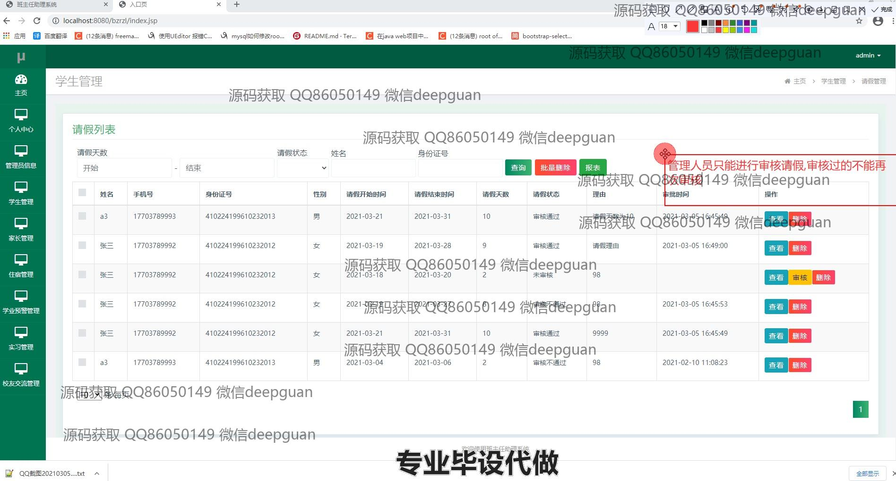
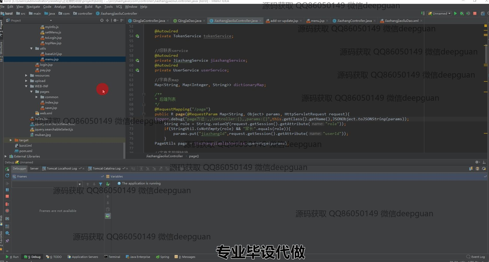
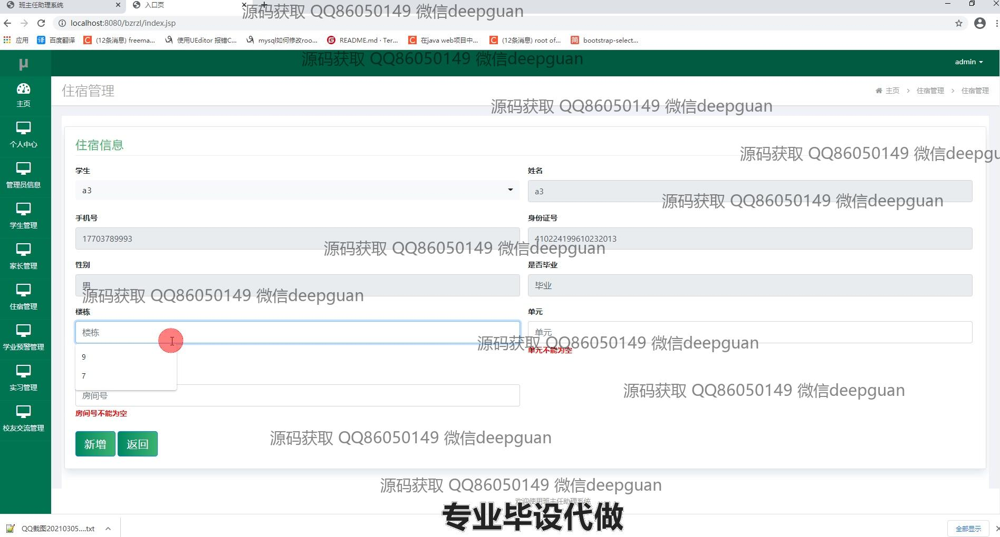

<h1 align="center">班主任助理系统的设计与实现</h1>

## 简介
班主任助理系统：角色分为管理员、学生、家长；功能涵盖学生信息管理、成绩统计、请假管理、家长交流、实习管理与校友交流，提升班级事务管理效率。    --计算机毕业设计源码；毕设源码；java毕业设计源码

## 联系方式

<h3 align="center">获取完整代码与数据库文件 + 微信：deepguan QQ: 86050149 QQ群: 783742310</h3>

<h3 align="center">可帮忙远程部署 包运行成功！提供远程部署、修改代码、设计文档指导、代码讲解等服务！</h3>

## 功能介绍（完整见运行截图）
管理员：管理员可在系统中进行登录和退出操作，访问主页和个人中心，主要负责管理学生、家长、宿舍、实习和校友交流等模块。此外，管理员可以处理请假申请、班会通知以及成绩管理，支持信息增删改查。界面提供了多种导航选项，包括新增用户和查看角色信息，同时维护系统用户的安全性和效率。

学生：学生用户需通过登录进入系统，以更新和查看个人信息。学生可以在系统中提交请假申请，查看考勤记录以及学校公告等信息。通过个人中心，学生能够管理自己的实习安排和宿舍信息，并与校友进行交流。在界面中，学生可以上传相关文件并查看成绩统计信息，以跟踪自身的学业进展。

家长：家长角色在系统中可以登录和退出，查看并更新个人信息。从家长管理模块中，家长可查看与教师和学校沟通的记录，包括出勤和成绩信息。家长还能够通过家长交流管理功能参与留言和提问，以了解学生的在校表现及校园活动，系统便利了家校之间的沟通和信息交互。

班主任：班主任用户需要通过系统进行登录并访问其个人中心，管理与学生和家长的交流，处理请假申请并发布班会通知。通过学生管理模块，班主任能够查看和编辑学生档案，生成并分析成绩报告，同时安排节假日值班。系统设计提升了班级管理效率，支持班主任执行日常的教学和事务处理。

## 运行截图

本代码来源于网络,仅供学习参考使用!

